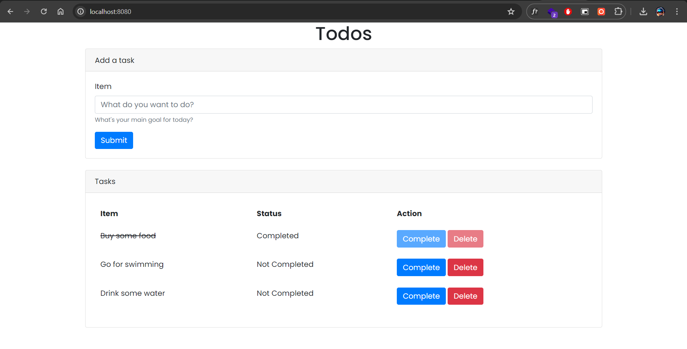

# Todo App Built with Go



## Introduction

A simple todolist application written in Go 

## Tech Stack
* MySQL installed
* Go installed

## Installation

* Clone this repo 

```bash
git clone https://github.com/igaimerca/go-todolist.git
```

* Change Directory

```bash
cd go-todolist
```

* Initiate `.env` file

```bash
cp .env.example .env
```

* Modify `.env` file with your correct database credentials and desired Port

## Usage

To run this application, execute:

```bash
go run main.go
```

You should be able to access this application at `http://127.0.0.1:8080`
